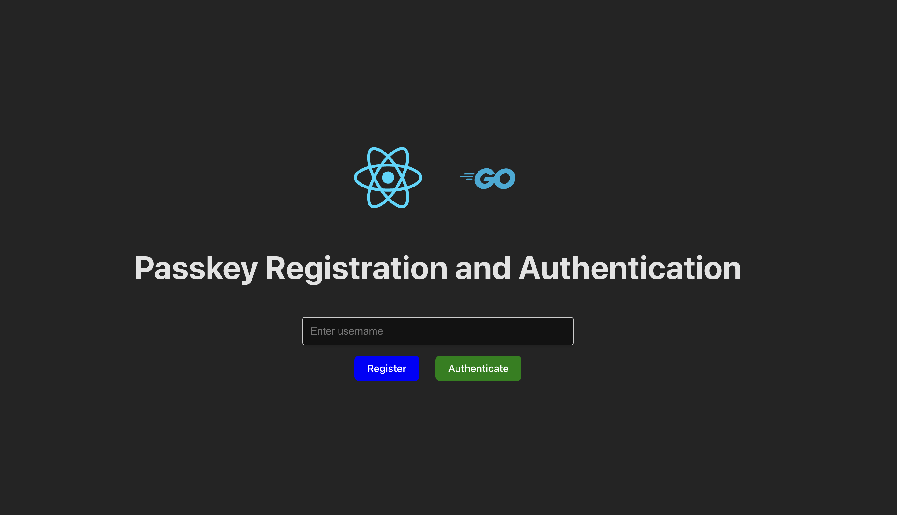
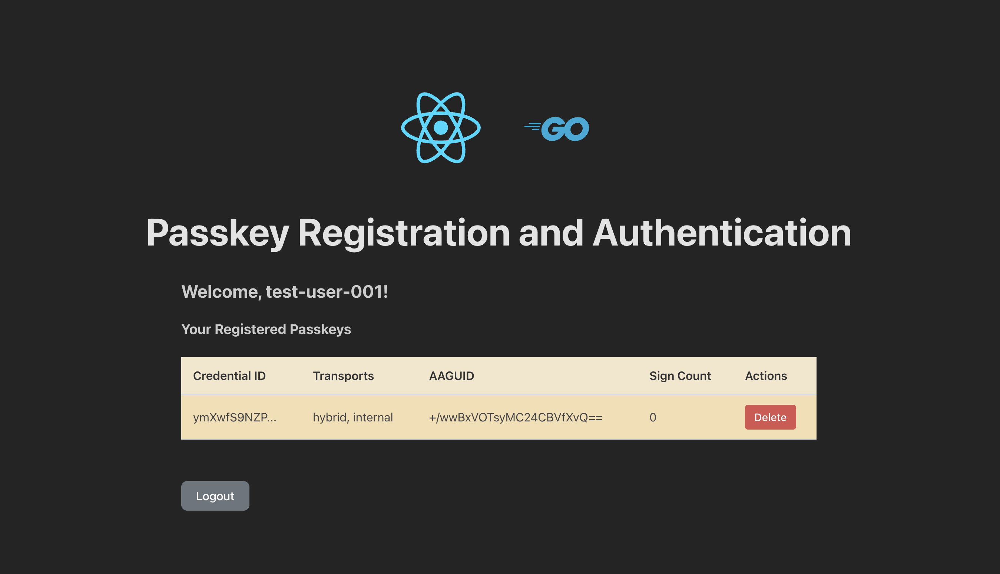

# passkey-auth-go

## Getting started
To start the app, you can use the `make` command. Follow these steps:

1. Ensure you have `make` installed on your system.
2. Run the following command in the project directory:

    ```bash
    make run
    ```

This will build and start the application.

## APP UI
### App login page

### App dashboard

